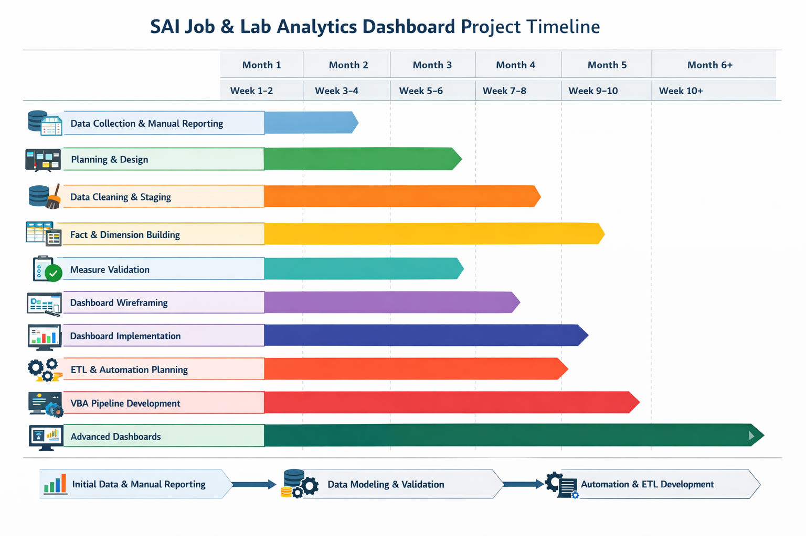

# 🏗️ SAI Job & Lab Analytics Dashboard

A Data Modeling & Automation Project for Operational Finance

---

## 🚀 Overview

This project has been an absolute thrill from start to finish! I dove headfirst into **gathering, wrangling, modeling, and visualizing real-world operational data** from SAI Environmental Consultants. Along the way, I practiced **data engineering, data pipelining, ETL design, dashboard creation, and financial analytics**, transforming a collection of messy Excel files into a **robust, automated, job-level finance model**.

I got hands-on experience designing **staging tables**, creating **fact and dimension tables**, implementing **calculated measures in Power Pivot**, and building **repeatable, automated ETL pipelines using VBA**. This project gave me a front-row seat to the full lifecycle of **end-to-end data analytics**.

---

## 🎯 Why This Project Started

At first, the goal was simple:

> “When my boss asks for job financial details, I want answers immediately.”

Manually digging through spreadsheets, pivot tables, payroll records, lab reports, and work authorizations was inefficient and error-prone. What started as a reporting convenience quickly evolved into a **full data modeling and automation journey**, with the ambition to create **scalable, reliable, and insightful dashboards**.

---

## 🔥 How It Started

The raw materials for this project were **Excel files from multiple sources**, each with its quirks:

* Work Authorizations (WA) from SCA
* Payroll exports
* Lab reports and lab rates
* Reoccupancy tracking
* Job listings

Challenges included:

* Inconsistent formatting
* Text stored as numbers
* Custom date formats
* Invisible characters
* Changing download names
* Historical contracts mixed with active ones

Instead of just cleaning manually, I **architected a repeatable, scalable process**, separating **raw downloads → staging tables → data model → dashboards**.

---

## 🧠 Planning Process

Before writing any formulas or code, I asked:

1. What are the **core entities**?
2. Which data should remain raw, and which should be transformed?
3. What relationships are needed for accurate analysis?
4. What should be a **calculated column** vs a **measure**?
5. What needs **automation**?
6. Where do errors most often occur?

I sketched:

* **Business Questions:**

  * Total labor cost per job
  * Lab cost per job
  * Technician cost and workload
  * Total job profitability vs billing
  * Lab utilization trends
  * Gross margins and profitability analysis

* **Data Model Design:**

  * **Staging tables:** lightly cleaned raw data
  * **Dimension tables:** descriptive context (`dim_job`, `dim_building`, `dim_technician`, `dim_lab`, `dim_reoccupancy`)
  * **Fact tables:** transactional numbers (`fact_payroll`, `fact_labs`)

* **Validation & Measures:**
  Defined sanity checks and audit metrics to ensure **all numbers tied back to reality**.

---

## 🏗 Design & Modeling Phase

I built a **star-schema style data model** in Power Pivot:

* **Dimensions:** dim_job, dim_building, dim_technician, dim_lab, dim_reoccupancy
* **Fact Tables:** fact_payroll, fact_labs
* **Relationships:** fully locked and validated
* **Calculated Measures:** Total Labor Cost, Total Lab Cost, Total Job Cost, Gross Margin, and more
* **Job-Centric Filtering Logic:** handled non-billable hours, multiple technicians per job, and alignment with reoccupancy letters

I practiced **data pipelining concepts** by transforming staging sheets into a clean, auditable model — true **lightweight data engineering in Excel**.

---

## ⚠️ Mistakes & Lessons Learned

Many challenges arose:

* Mismatched IDs across tables → solved via consistent mapping
* Duplicate or missing entries → handled with deduplication & conditional logic
* Complex derived fields (e.g., number of technicians per job) → required step-by-step debugging
* Broken Power Pivot relationships and formula errors

Every mistake was a **learning opportunity**, teaching me to **debug systematically, rebuild cleanly, and preserve working components**.

---

## ⏰ Project Timeline

A visual overview of how the project progressed from initial data gathering to automated pipelines.

| Phase                                      | Timeline  | Key Activities                                                                  |
| ------------------------------------------ | --------- | ------------------------------------------------------------------------------- |
| Initial Data Collection & Manual Reporting | Week 1-2  | Gather raw files, explore inconsistencies, start manual pivot reporting         |
| Planning & Data Model Design               | Week 3-4  | Define business questions, plan star-schema, design dashboards                  |
| Data Cleaning & Staging                    | Week 4-5  | Standardize IDs/dates, remove duplicates, build staging tables                  |
| Fact & Dimension Implementation            | Week 5-6  | Create dimensions & fact tables, define calculated measures                     |
| Measure Validation & Sanity Checks         | Week 6-7  | Verify KPIs, debug formulas, validate against raw data                          |
| Dashboard Wireframe & Design               | Week 7-8  | Plan visualization, KPI mapping, interactivity                                  |
| Dashboard Implementation                   | Week 8-9  | Build functional KPI dashboards, integrate relationships & filters              |
| Automation & ETL Planning                  | Week 9-10 | Define automated ingestion, data cleaning, and repeatable workflow              |
| VBA Pipeline Development                   | Week 10+  | Auto-detect downloads, clean & transform data, implement automation module      |
| Advanced Dashboards & Features             | Month 6+  | Add operational timeline, technician trends, margin alerts, historical tracking |

---

## 📊 Dashboards in Progress / Planned

1. **Executive Summary** – KPI cards, revenue, total costs, gross margin, top 5 profitable jobs
2. **Job-Level Financial Performance** – Labor & lab costs per job, cost vs billing, profitability
3. **Technician Performance** – Hours, cost per technician, job assignments, labor contribution
4. **Lab Utilization & Profitability** – Cost by lab facility, margin per sample, SCA comparison
5. **Operational Timeline** – Reoccupancy phases, technician assignment windows, cost accumulation trends

---

## 🛠 Automation & Data Engineering Work

* Designed **repeatable ETL pipeline** for staging → model → dashboard
* Implemented **VBA scripts** to auto-detect newest files, clean, and transform data
* Data normalization, historical contract filtering, and date standardization
* Built **measure-driven semantic layer**, replacing hard-coded calculations
* Systematic error handling, version-agnostic file management, and pipeline reproducibility

---

## 🌟 Key Learnings & Highlights

* Built **end-to-end data pipeline** from raw files to dashboards
* Applied **data wrangling, Power Pivot, DAX, and star-schema modeling**
* Practiced **data engineering thinking** inside Excel
* Learned iterative **debugging, validation, and scalable workflow design**
* Developed dashboards that provide **actionable operational & financial insights**
* Experienced the satisfaction of turning **chaos into structured, repeatable analytics**

---

## 💻 Tech & Tools

* Excel / Power Pivot for modeling & calculations
* DAX formulas for measures & calculated columns
* Staging tables for raw inputs
* VBA for ETL-style automation & pipeline
* GitHub for versioning, documentation, and iterative improvements

---

This project has been **an amazing journey**, combining **data wrangling, modeling, analytics, and automation**. From messy Excel downloads to a functioning, scalable KPI dashboard, it reflects **a full end-to-end analytics workflow** and my growth as a data professional!
